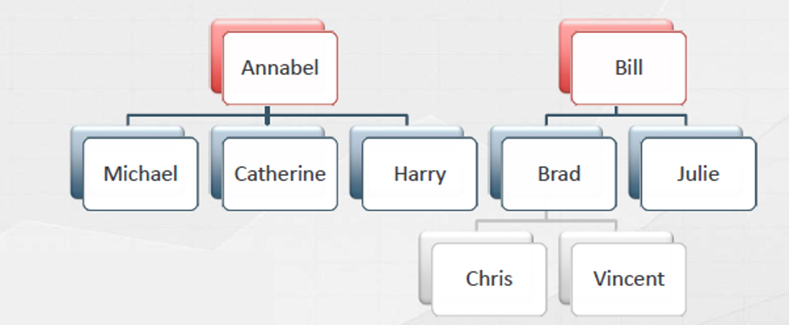

# HIERARCHIES

Hierarchies are pre-defined exploration path, like -:

- Year > Semester > Quater > Month > Day
- Category > Sub-category > Product

Hierarchies make browsing a model easier.

<u>***Types of Hierarchy***</u>

- **Natural Hirarchies**

For natural hierarchies, there exists a *1:M relationship* between the parent and children

- **Unnatural Hierarchies**

The data is shuffled in case of unnatural hierarchies.

<u>***Properties of Hierarchy***</u>

- All columns in a hierarchy need to belong to the same table.
- Therefore, if we have multiple tables then, we can use the `RELATED()` function to get the columns in right place and we may hide those tables, thereafter.

## Filtering & Cross-filtering

We know that the filters from the *One-Side* of the table automatically propagated to the *Many-Side* of the table automatically.

To verify whether the a table is getting filtered by a certain coulmn from the *One-Side* of the table or, not; we can use a function named `ISFILTERED()`

### `ISFILTERED()`
---
This function returns a boolean value as the output. Therefore, if the filtering is happening then, it will return `TRUE` otherwise `FALSE`.

If we have a slicer of `Brands` in the report then,to verify whether the `Product[Brand]` is filtering the `Sales` Table or, not ; we have to write the following DAX expression :

```DAX
Check = ISFILTERED ( Product[Brand] )
```

### `ISCROSSFILTERED()`
---

When the `Product[Brand]` is filtering the `Sales` table, then, the other columns in the "*Products*" table (*One-Side*) along withe the `Sales` table gets cross-filtered.

Therfore, the result of the below expressions will be returned as `TRUE`

```DAX
Check = ISCROSSFILTERED ( Product[Colors] ) //Returns TRUE
```
and

```DAX
Check = ISCROSSFILTERED ( Sales[Net Price] ) // Returns TRUE
```

***When we have a slicer from the Many-Side of the table***

Let's say we have the `Sales[Quantity]` slicer present in the report then, the result of the following functions would be as follows :

```DAX
Check = ISFILTERED ( Sales[Quantity] ) // Returns TRUE
```
and any other column from the "*Sales*" table gets cross-filtered, thus, for `Sales[Net price]` column :

```DAX
Check = ISCROSSFILTERED ( Sales[Net Price] ) // Returns TRUE
```
But, as the slicer belongs to the *Many-Side* of the relationship, therefore none of the tables in the *One-Side* gets cross-filtered, therefore, the result of the following DAX expression will be `FALSE`:

```DAX
Check = ISCROSSFILTERED ( Product[Colors] ) // Returns FALSE
```

## Percentage Over Parent

If we have a hierarchy as :

***Category > Sub-Category > Products***

then, the percentage over the parent refers to :

- Percentage of *Products* over its belonging *Sub-Category*
- Percentage of *Sub-Categories* over its belonging *Category*
- Percentage of *Categories* over the *Grand Total*

To perform the above calculation with a single measure, we are going to use `ISINSCOPE()` as a key function.

### `ISINSCOPE()`
---
`ISINSCOPE()` is similar to `ISFILTERED()` but, it also checks that the column is currently used as a group-by column or, not.

This function is very much useful to avoid detecting the slicers as filters.

To calculate the "*Percentage over the parent*" calculation, we have to write the following DAX expression :

```DAX
Percentage to Parent =
VAR CurrentSales = [Sales Amount]
VAR SubCatSates =
    CALCULATE(
        [Sales Amount],
        ALLSELECTED('Product'[Product Name])
    )
VAR CatSales =
    CALCULATE(
        [Sales Amount],
        ALLSELECTED('Product'[Subcategory])
    )
VAR TotalSales =
    CALCULATE(
        [Sales Amount],
        ALLSELECTED('Product')
    )

VAR RatioToParent =
    IF(
        ISINSCOPE('Product'[Product Name]),
        DIVIDE(CurrentSales,SubCatSates),
        IF(
            ISINSCOPE('Product'[Subcategory]),
            DIVIDE(CurrentSales,CatSales),
            IF(
                ISINSCOPE('Product'[Category]),
                DIVIDE(CurrentSales,TotalSales)
            )
        )
    )

RETURN
RatioToParent
```

## Parent-Child Hierarchy

In some scenarios, we can also have ragged/unbalanced/parent-child hierarchies as follows :



In such hierarchies, data is associated with both leaves and nodes.

While *SSAS(Tabular)* has features to handle such parent-child hierarchies but, neither *Power BI* nor *Power Pivot* has such luxury.

Therefore, we need to perform some work-around to deal with this kind of problem.

As a desired solution to such problem, we expect

- The numbers in *child-node* must add-up to give the number of their respective *parent-node*.
- The *Leaves* shouldn't expand further.

***Solution***

The parent-child hierarchy shown in the above image can be represented in a table format as follows :

| PersonKey | Name      | ParentKey |
| --------- | --------- | --------- |
| 1         | Bill      |           |
| 6         | Annabel   |           |
| 7         | Catherine | 6         |
| 8         | Harry     | 6         |
| 9         | Michale   | 6         |
| 2         | Brad      | 1         |
| 3         | Julie     | 1         |
| 4         | Chris     | 2         |
| 5         | Vincent   | 2         |


### `PATH()`

The `PATH()` function performs the parent-child navigation recursively and we can create a calculated column for getting the full path of each node as follows :

```DAX
FullPath =
PATH ( Persons[PersonKey], Persons[ParentKey] )
```
After execution, the modified table will be as follows :

| PersonKey | Name      | ParentKey | FullPath |
| --------- | --------- | --------- | -------- |
| 1         | Bill      |           | 1        |
| 6         | Annabel   |           | 6        |
| 7         | Catherine | 6         | 6/7      |
| 8         | Harry     | 6         | 6/8      |
| 9         | Michale   | 6         | 6/9      |
| 2         | Brad      | 1         | 1/2      |
| 3         | Julie     | 1         | 1/3      |
| 4         | Chris     | 2         | 1/2/4    |
| 5         | Vincent   | 2         | 1/2/5    |


### `PATHITEM()`


Now, we need to extract the various levels of hierarchy as the calculated columns as follows :

**For Level-1**
```DAX
Level-1 =
LOOKUPVALUE(
    Persons[Name],Persons[PersonKey],PATHITEM(Persons[FullPath],1,INTEGER)
)
```
**For Level-2**
